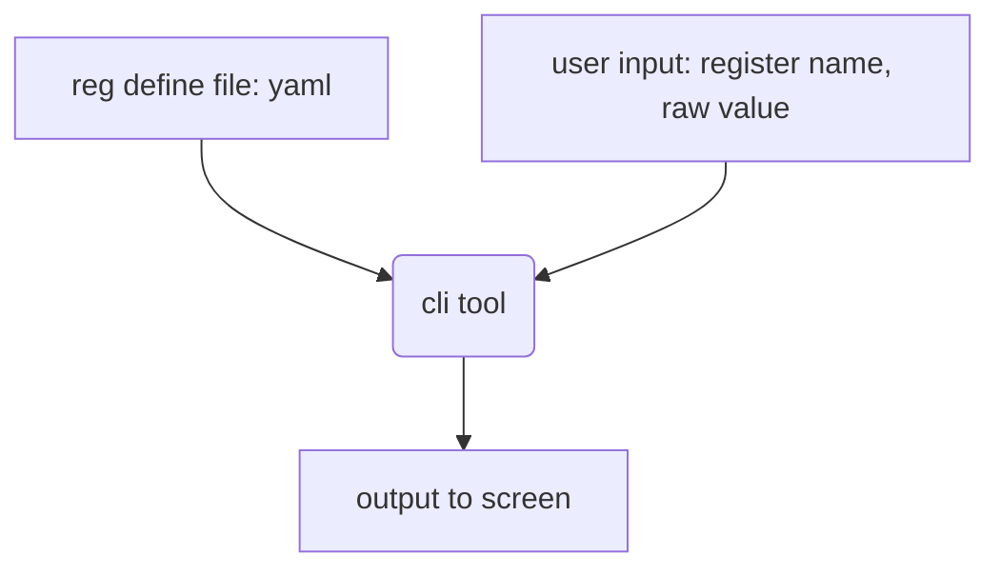

# regviewer
the CLI tool for embedded engineer to get each field value from a register.
## pre requesst(if you do not love the exe package)
```bash
pip install cmd2 pyyaml fuzzywuzzy
```
## how to use it?
once start the cli.py or *.exe
```bash
(Cmd) lscnf
tc27x.yaml
test_cnf.yaml
xw32.yaml
```
lscnf will list the reg define file in your ./cnf
```bash
(Cmd) ldcnf tc27x
the cnfiguration file load succeed
```
ldcnf will load the configuration file for your calculate

```bash
(Cmd) lsreg
FLASH_RRD0
FLASH_RRD1
FLASH_UBAB_CFG
FLASH_UBAB_STAT
FLASH_UBAB_TOP
GPT12_ACCEN0
.......
```
lsreg will list all register defines in the specified yaml file.
```bash
(Cmd) search STM
SEARCH REGISTER | STM
--------------------------------
OPTIONS         |
                |DSADC_CH_TSTMP
                |GTM_DPLL_PSTM_0
                |GTM_DPLL_PSTM_1
                |STM_ACCEN0
                |STM_ACCEN1
                |STM_CAP
                |STM_CAPSV
                |STM_CLC
                |STM_CMCON
                |STM_CMP
                |STM_ICR
                |STM_ID
                |STM_ISCR
                |STM_KRST1
                |STM_KRSTCLR
                |STM_OCS
                |STM_TIM0
                |STM_TIM0SV
                |STM_TIM1
                |STM_TIM2
                |STM_TIM3
                |STM_TIM4
                |STM_TIM5
                |STM_TIM6
```
use search to filter the register define
```bash
(Cmd) calc -r STM_ACCEN0 -v 0x12345678
Register--->STM_ACCEN0
EN0: 0d0 0x0 0b0
EN1: 0d0 0x0 0b0
EN2: 0d0 0x0 0b0
EN3: 0d1 0x1 0b1
EN4: 0d1 0x1 0b1
EN5: 0d1 0x1 0b1
EN6: 0d1 0x1 0b1
EN7: 0d0 0x0 0b0
EN8: 0d0 0x0 0b0
EN9: 0d1 0x1 0b1
EN10: 0d1 0x1 0b1
EN11: 0d0 0x0 0b0
EN12: 0d1 0x1 0b1
EN13: 0d0 0x0 0b0
EN14: 0d1 0x1 0b1
EN15: 0d0 0x0 0b0
EN16: 0d0 0x0 0b0
EN17: 0d0 0x0 0b0
EN18: 0d1 0x1 0b1
EN19: 0d0 0x0 0b0
EN21: 0d1 0x1 0b1
EN22: 0d0 0x0 0b0
EN23: 0d0 0x0 0b0
EN24: 0d0 0x0 0b0
EN25: 0d1 0x1 0b1
EN26: 0d0 0x0 0b0
EN27: 0d0 0x0 0b0
EN28: 0d1 0x1 0b1
EN29: 0d0 0x0 0b0
EN30: 0d0 0x0 0b0
EN31: 0d0 0x0 0b0
```
use calc to calculate the field value for one register.
```bash
(Cmd) quit
```
quit it directly
## why I create it?
When I reading code, it is boring to start the calculator and calculate each field value of register by your mind. then I choose to write a general solution.
## how does it work?

- yaml file which located in ./cnf
- cli tool were power by cmd2

## how to convert the register define to yaml file
1. Some chip vender will provide  c files which defined registers in struct union format this kind of stuff were easy for us
to analyze and write the code to convert into yaml file.
the ./tool/parse_struct.py provide the way to extract tc27D defines from the infrastructure file.   
2. Unfortunately some vender's standard library were not in such format. stm32 the most widely used mcu, it use the so many macro 
for engineer configure regster by shift operation. there are some 3rd party repo for your to convert to yaml file.
3. we also recommand engineer to edit their own yaml file. we provide internl python function to write their own yaml file without consider yaml format.

## project status
expand the yaml file support it's our main job currently.   
- [x] tc27D yaml file
- [x] tc29B yaml file
- [ ] tc33A yaml file
- [ ] tc37A yaml file
- [ ] tc39B yaml file
- [x] tc23A yaml file
- [ ] stm32 all series yaml file
- [ ] more work
  

